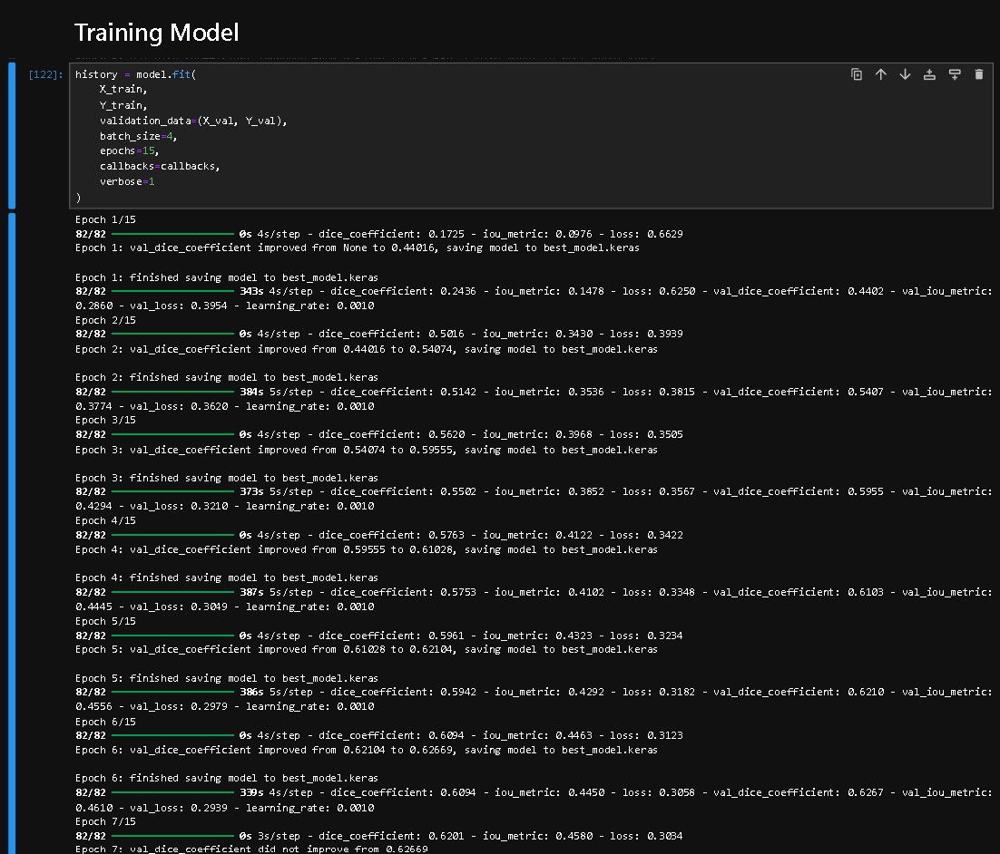
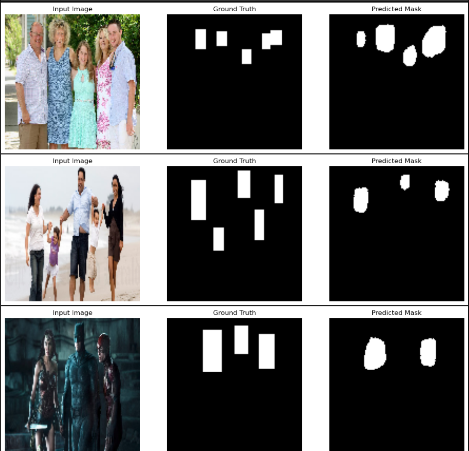
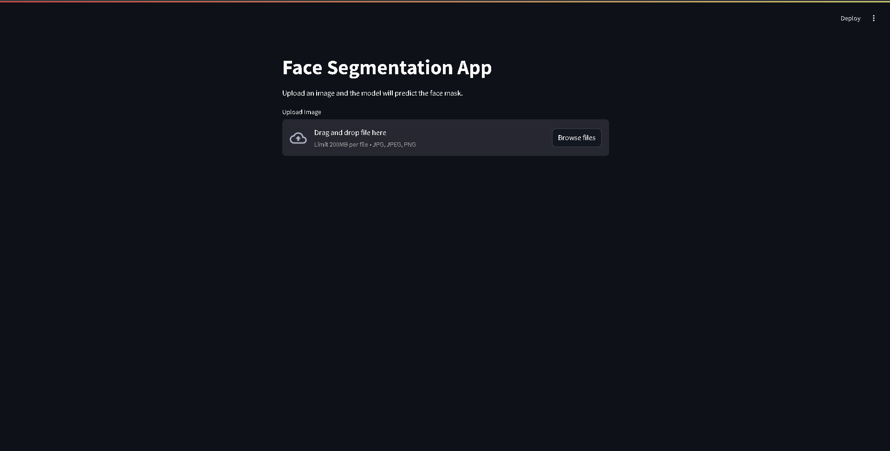
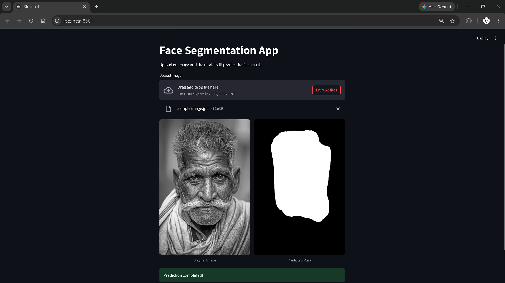

# Face Segmentation using MobileNetV2 U-Net

A deep learning-based Face Segmentation project built using TensorFlow and Keras. This project trains a MobileNetV2-powered U-Net architecture to identify and segment face regions from images and provides an interactive Streamlit web application for real-time predictions.

---

## Project Overview

Face segmentation is a computer vision task that classifies each pixel of an image into face or non-face regions.

In this project:

- A MobileNetV2-based U-Net architecture is used.
- Face masks are generated from bounding-box annotations.
- The model is trained using TensorFlow/Keras.
- A Streamlit application is deployed for user-friendly inference.
- Users can upload an image and instantly visualize the predicted face mask.

---

## Features

- MobileNetV2 Encoder
- U-Net Decoder Architecture
- Dice Loss + Binary Cross Entropy Loss
- IoU and Dice Coefficient Evaluation Metrics
- Streamlit-based Web Application
- Real-Time Image Upload and Prediction
- TensorFlow/Keras Implementation

---

## Project Structure

```text
Face_Segmentation_Project/
│
├── screenshots/
│   ├── 01_project_structure.png
│   ├── 02_training_metrics.png
│   ├── 03_sample_prediction_notebook.png
│   ├── 04_streamlit_homepage.png
│   └── 05_streamlit_prediction.png
│
├── app.py
├── final_face_segmentation_model.keras
├── face segmentation.ipynb
├── requirements.txt
├── README.md
│
└── sample_outputs/
```

---

## Model Architecture

The segmentation network uses:

### Encoder

- MobileNetV2 Backbone
- Pretrained Feature Extractor
- Skip Connections

### Decoder

- Upsampling Layers
- Convolution Blocks
- Feature Fusion via Skip Connections

### Output

- Binary Segmentation Mask
- Shape: `(128 × 128 × 1)`

---

## Training Results

The model was trained using custom face segmentation data.

### Training Metrics



---

## Sample Prediction (Notebook)

Prediction generated directly from the trained model during evaluation.



---

## Streamlit Application

### Homepage

The Streamlit application allows users to upload an image and perform segmentation.



---

### Prediction Result

The uploaded image is processed and the trained model predicts the corresponding face mask.



---

## Technologies Used

- Python
- TensorFlow
- Keras
- MobileNetV2
- NumPy
- OpenCV
- Matplotlib
- Streamlit

---

## Installation

Clone the repository:

```bash
git clone https://github.com/yourusername/Face-Segmentation-Project.git
```

Navigate to the project directory:

```bash
cd Face-Segmentation-Project
```

Install dependencies:

```bash
pip install -r requirements.txt
```

---

## Running the Streamlit App

Launch the application:

```bash
streamlit run app.py
```

Open your browser and visit:

```text
http://localhost:8501
```

---

## Model File

The trained model is not included in this repository because it exceeds GitHub's file-size limits.

To run the project locally, place the trained model file:

final_face_segmentation_model.keras

inside the project root directory before launching the Streamlit application.

---

## Future Improvements

- Higher Resolution Predictions
- Better Face Boundary Segmentation
- Multi-Class Facial Feature Segmentation
- Real-Time Webcam Integration
- Cloud Deployment

---

## Author

Rajdeep Sen

Deep Learning | Computer Vision | Machine Learning

---

## License

This project is intended for educational and research purposes.
